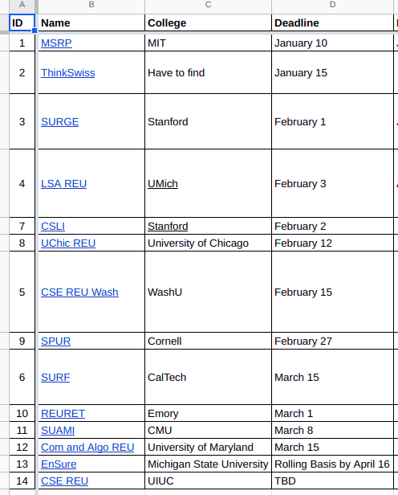

<h1 id="top-page">Roadmap for int'l students in CS (Research track)</h1>

## Undergrad

### Freshmen
1. X-SIG
1. Self-studying research related materials
1. Apply REUs<a id="reu-inline" href="#reu-note">[1]</a> (see other [examples of REU programs](#example-of-some-reu-programs))
1. Study AI (if AI research) from many resources. E.g. online courses like Coursera, Stanford online, books like [Dive into Deep Learning PyTorch](assets/Dive_into_Deep_Learning_PyTorch.pdf), [MIT Deep Learning online book](https://www.deeplearningbook.org/), etc.

### Sophomore
1. Apply Google's CSRMP
1. Try to have a paper published. The more prestigious the better ([Conference ranking](#conference-ranking))
1. Apply REUs

### Junior
1. Continue finding REUs
1. Having at least another paper published. By this time, if you struggle with having a published paper, follow 

### Senior
1. Ask Profs/Supervisors for LORs (at least 3)
1. GRE (optional for many schools)
1. Statement of purpose (SOP)
1. Personal history statement (PHS)
1. Application fee (join virtual info sessions may receive fee waiver)
1. Apply for PhD and good luck :four_leaf_clover:

<a href="#top-page">[Back to top]</a>

## Grad school

### Application
1. Grad admissions consultants:
    * Accepted.com (MS/MBA/PhD) ([website](https://www.accepted.com/))
    * ElitePrep Vietnam (MS/MBA/PhD) ([website](https://eliteprepvn.com/services/bac-cao-hoc/) | [Fb](https://www.facebook.com/eliteprepvn/))
    * ACE mentorship (MS/MBA) ([website](https://acementorship.com/) | [Fb](https://www.facebook.com/acementorshipprogram/))
    * USGuide (MS/MBA/PhD) ([Fb](https://www.facebook.com/USGuide/))

<a href="#top-page">[Back to top]</a>

## Example of some REU programs
1. check [assets/Quan-REU_Research-2023](assets/Quan-REU_Research-2023.md), generated from "main file"<a id="reu-inline" href="#reu-note">[1]</a>
1. From github and outside US:
    * [himahuja/Research-Internships-for-Undergraduates](https://github.com/himahuja/Research-Internships-for-Undergraduates)
    * [deutranium/Summer-2022-Research-Opportunities](https://github.com/deutranium/Summer-2022-Research-Opportunities)

<a href="#top-page">[Back to top]</a>

## Ways to earn research experience + publish paper
1. Join residency programs in Vietnam such as FPT-residency or VinAI residency (2-year long)
1. Join [Application Driven Mathematics](https://adm-vietnam.github.io/) (ADM) in Vietnam (this program is new) (6-month long)

## Conference ranking

* [CORE](http://portal.core.edu.au/conf-ranks/) (data collected from CORE2023)
* [conferenceranks.com](http://www.conferenceranks.com/) (data collected from ERA2010, Qualis2012, and MSAR2014)
* [Research.com](https://research.com/conference-rankings/computer-science) (data collected in 2021)

<a href="#top-page">[Back to top]</a>

---

<footer>
  
[1]: REU resources here:
  <a href="assets/Quan-REU_Research-2023.csv">main file</a> /
  <a href="https://www.nsf.gov/crssprgm/reu/">NSF-REU</a> /
  other REU lists in <a href="assets">&#x2f;assets&#x2f;</a>.
  

</footer>
